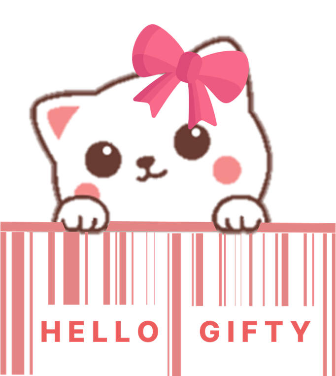
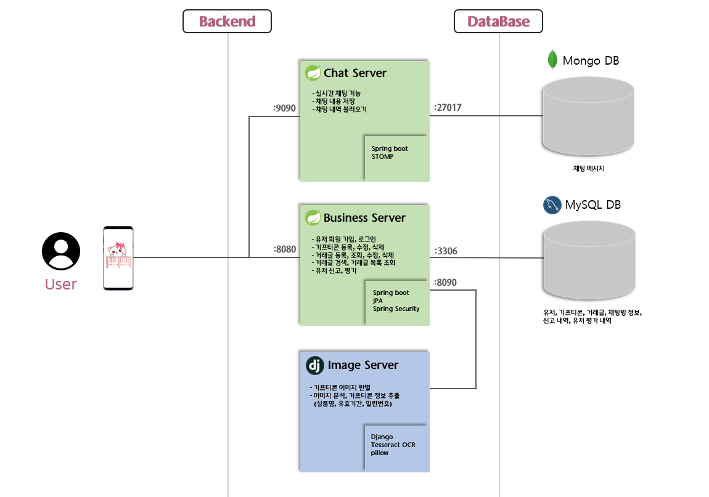
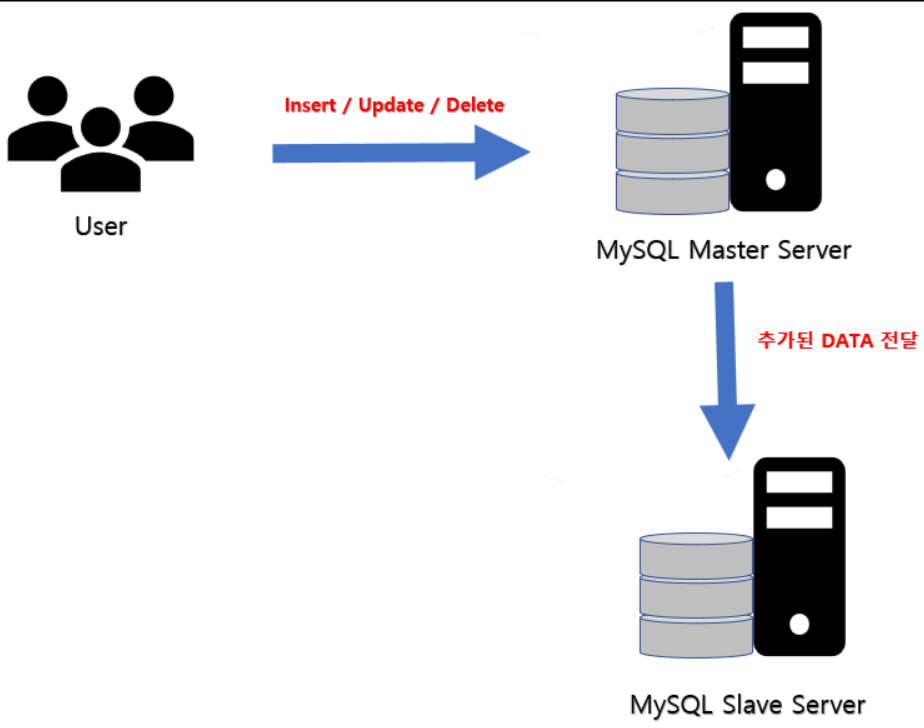
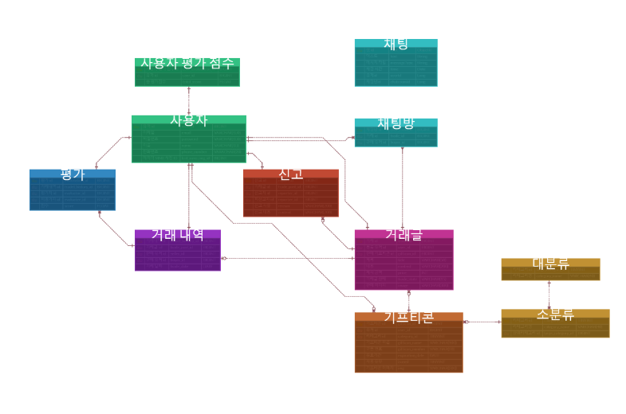

    

# HelloGifty
## 주제

<aside>
💡 휴대폰 속 기프티콘 관리 및 거래 플랫폼 서비스

</aside>

## 배포

[http://k7a705.p.ssafy.io](http://k7a705.p.ssafy.io)

## 📒 Notion

---

`A705 팀 노션 링크`

[https://www.notion.so/A705-d26e2a479c8f412fb2c1963f6276c4a1](https://www.notion.so/A705-d26e2a479c8f412fb2c1963f6276c4a1)

모두가 봐야할 공지, 참고 할 링크 등을 모아 관리했습니다. 그리고 항상 모든 회의 및 피드백은 기록으로 남겨두어서 잘 반영할 수 있도록 하였습니다. 컨벤션 규칙, 요구사항 정의서, API 문서 등도 노션에 기록하여 모두가 항시 확인할 수 있도록 관리했습니다.

## ✨Overview

---

💡 
통계청 조사 결과에 따르면 최근 5년간 기프티콘(모바일 상품권) 시장은 꾸준히 성장 중에 있습니다.
하지만 시장이 커져감에 따라 생기는 부작용도 증가하고 있습니다.

첫째로, 기업들이 기프티콘 미사용으로 얻는 '낙전 수입'이 증가하고 있다는 것입니다.
소비자 입장에서 문자 메시지로 수신한 기프티콘을 잊어버려 유효기간이 지나버리거나
사용할 수 있는 매장이 주변에 없어 기프티콘을 사용하지 못하는 경우가 존재하기 때문입니다.

둘째로, 기프티콘 거래에서 발생하는 문제점이 존재합니다.
마땅히 기프티콘을 거래할 플랫폼이 없어 중고 시장에 판매글을 올려 거래를 하는 경우가 많고,
체계적이지 않은 거래 시스템으로 인해 바코드를 노출하여 올리거나, 바코드 노출을 유도하는 사기 피해 사례가 증가하고 있습니다.

그래서 저희는 사용자가 기프티콘을 깜빡하고 사용하지 못하는 경우가 없도록
MMS 메시지에 첨부된 기프티콘을 자동으로 등록하여 체계적으로 관리할 수 있고, 
사용하지 않을 기프티콘을 다른 사용자에게 판매할 수 있으면서 동시에 바코드 노출과 같은 
피해 사례가 생기지 않도록 도와주는 **기프티콘 관리 및 거래 플랫폼 Hello Gifty**를 개발하였습니다.

## 🖼서비스 화면

---

### 메인 화면

### 기프티콘 등록 페이지

### 기프티콘 조회 페이지

### 기프티콘 판매 페이지

### 채팅 페이지

### 프로필

## ✨ 주요 기능

---

- 서비스 설명 : 기프티콘 관리 및 거래 플랫폼
- 주요 기능 :
    - 기프티콘 자동 등록
    - 기프티콘 관리
    - 기프티콘 거래

 

## 🛠️ 개발 환경

---

🖱**Backend**

- IntelliJ
- Visual Studio Code
- spring boot 2.4.5
- spring-boot-jpa
- Spring Security
- Java 11
- AWS EC2
- mysql
- mongoDB
- OCR (pytesseract)
- django

🖱**Frontend**

- Visual Studio Code
- React.js 18.1.0
- react-native 0.70.6
- react navigation 6.0.13
- react-stomp 5.1.0
- react native paper 5.0.0-rc.10

🖱**CI/CD**

- aws ec2
- docker
- apache
- jenkins

## 🌐 서비스 아키텍처

---

## ✨자동 배포와 배포 특이점

---

저희는 자동 배포를 위해서 다음과 같이 구성하였습니다.

- Jenkins와 배포 서버를 분리함으로써 Jenkins 사용성을 증가시켰습니다. Jenkins 내에서 서버와 상관없이 빌드를 완료하고 publish over ssh 플러그인을 통해서 빌드 결과를 배포 서버로 전송하였습니다. 또한 실행중인 서버 대신 Jenkins로 부터 전달 받은 jar파일을 동작시킵니다.

## ✨기술 특이점

---

- **OCR (Optical Character Recognition)**
    
    어플리케이션에서 mms에 첨부된 이미지 파일들을 서버로 전송하면, 서버에서는 이미지를 Tesseract를 이용한 광학 문자 인식을 통해 이미지 속의 텍스트들을 인식하여 데이터화하고, 정규표현식을 포함한 필터링 과정을 거쳐 기프티콘의 상품명과 일련번호, 유효기간을 추출합니다.  학습 데이터를 교체하고 oem, psm 등의 모드 변경을 통해 텍스트 인식의 정확도를 향상시켰습니다.
    

- **STOMP (Simple Text Oriented Messaging Protocol)**
    
    채팅 기능 구현을 위해서 WebSocket을 사용하여 실시간 채팅 교환 서비스를 구현했습니다. STOMP는 WebSocket을 기반에 pub/sub 구조를 더하여 메시지를 publish하는 기능, subscribe하는 기능을 명확히 분리하게 해줍니다. Chat Server의 Message Broker를 통해서 사용자는 실시간으로 채팅을 보내거나 받을 수 있습니다.
    

- **MySQL 이중화**
    
    mysql 서버를 docker를 사용해 2대를 띄워 복제를 위한 계정을 생성하고 grant replication으로 복제 관련 권환을 부여한다. 또한 mysqld.conf를 설정하여 server 아이디를 다르게 설정하고 master의 로그파일 이름과 position값을 통해서 replication 서버에서 change host명령을 사용하여 mysql 이중화를 구현함. 
    
    

    

## 👨‍👩‍👧 협업 툴

---

- `Git`
- `Jira`
- `Notion`
- `Mattermost`
- `Webex`

---

## ✨코드 컨벤션

---

- `의미 없는 변수명 X, 최대한 직관적으로 변수명 지어주세요.	⇒ 유지보수 힘들고, 알아보기 힘드니 반드시 지양해주세요.
- 메서드 이름은 소문자로 시작하고, 동사로 지으면 좋다! ex) getName()
- 변수명, 메서드 이름은 camelCase로 지어주세요
- 클래스 이름은 대문자로 시작합니다
- 리액트 컴포넌트명은 PascalCase로 지어주세요.

해당 [Code Convention 가이드](https://udacity.github.io/git-styleguide/), [네이밍 규칙](https://tyboss.tistory.com/entry/Java-%EC%9E%90%EB%B0%94-%EB%84%A4%EC%9D%B4%EB%B0%8D-%EA%B4%80%EC%8A%B5-java-naming-convention)를 참고하여 정했습니다.

## ✨Git 컨벤션

---

`Feat:    새로운 기능을 추가할 경우` 

`Fix:     버그를 고친 경우` 

`Design:   코드 포맷 변경, 간단한 수정, 코드 변경이 없는 경우` 

`Refacto: 프로덕션 코드 리팩토링` 

`Docs:    문서를 수정한 경우(ex> Swagger)` 

`Rename:  파일 혹은 폴더명 수정 및 이동` 

`Remove:  파일 삭제`

`커밋 타입: 수정된 내역 설명` 

`ex) Feat: Add follow API`

## 💡Git Flow 브랜치 전략

---

- Git Flow model을 사용
- 사용한 브랜치
- feature - 백엔드/프론트엔드 각 기능
- backend - 백엔드
- frontend - 프론트엔드
- develop - 개발
- master - 배포
- Git Flow 진행 방식
    1. feature 브랜치에서 기능 개발이 완성되면 [backend or frontend] 브랜치로 merge 한다.
        
        ⇒ pull request 시 이상이 없는지 확인하고 push 후 merge를 진행 한다.
        
    2. backend, frontend 브랜치에서 서로 연결되는 작업 완성 시 develop 브랜치로 pull request를 통해 merge한다.
    3. 다음 배포 버전이 준비되면 master 브랜치로 merge한다.
- feature 브랜치 이름 명명 규칙
    - `[FE or BE]/기능`
    ex) BE/Gifticon
    ex) FE/MainPage

## 🧮 Jira

---

협업 및 일정, 업무 관리를 위해 Jira를 이용하였습니다. 매주 월요일 오전 회의에서 한 주동안 진행되어야 할 주 단위 계획을 짜고, 진행할 이슈들을 스프린트를 만들어 등록했습니다. 스프린트는 일주일 단위로 진행하였습니다.

- Epic : Backend, Frontend/(기능)으로 나누어 구성하였습니다.
- story : 세부 구현 사항을 작성하였습니다.

story에 예상 시간(story point)을 기록해 중요도에 따라 더 세세하게 일정 관리를 했고 Mattermost에 알림을 등록하여 작업 상황을 실시간으로 확인할 수 있도록 했습니다.

### ✨ ER Diagram

---

- 정규화된 테이블
- 테이블 간 관계 설정

### ✨ EC2 포트 정리

---

**포트 번호**

| PORT | 이름 |
| --- | --- |
| 80 | Apache |
| 3306 | MySQL DB(Master) |
| 3307 | MySQL DB(Replica) |
| 3308 | MySQL DB(Replica) |
| 8080 | Main Server (Spring) |
| 8081 | Android Device |
| 8090 | Image Server (Django) |
| 9090 | Chat Server (Spring) |
| 27017 | Mongo DB |

### 👨‍👩‍👧 팀원 역할

---

- **노용래(팀장)** - `프론트엔드`
    - Figma를 사용한 와이어프레임 제작
    - 네이티브를 이용한 프론트엔드 MMS 저장소의 기프티콘 이미지 파일 등록 기능
    - 프론트엔드단 채팅, 거래 기능
    - 프로필, 신고 기능  
     
- **이주영** - `프론트엔드`
    - Figma를 사용한 와이어프레임, 스토리보드 제작
    - 내 쿠폰 관리,  Detail Page, 판매하기, 정보 수정, Image Crop 기능
    - 쇼핑 page, 검색 기능
     
- **김민지 -** `벡엔드`
    - 기프티콘 관리 및 저장 REST API 구축
    - 판매글 및 검색 REST API 구축
     
- **조민수 -** `벡엔드`
    - EC2 서버 구축
    - Docker
    - MySQL Replication
     
- **최규섭** - `백엔드`
    - 거래, 유저 평가, 유저 신고, 유저 정보 REST API 구축
    - Tesseract OCR을 이용하여 이미지에서 기프티콘 정보를 추출하는 이미지 서버 구축
    - WebSocket 기반 실시간 채팅 기능을 제공하는 채팅 서버 구축

---
